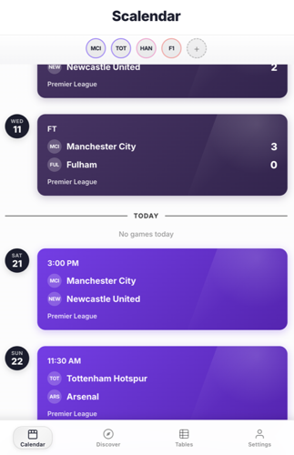
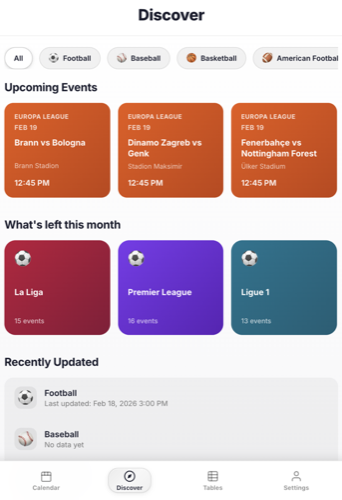
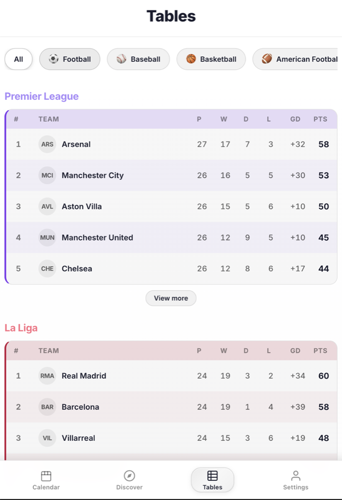

# Scalendar

Scalendar is a multi-sport app that helps you track schedules and standings in one place.

## Features

### Calendar Page

- Starts centered on today
- Shows your personalized schedule based on selected teams
- Supports football, F1, baseball (NBA/NFL marked as Work in progress)

### Discover Page

- Highlights upcoming events
- Shows what is left this month
- Includes recently updated sections by sport

### Tables Page

- League standings and rankings by sport
- Filter by sport and league
- Includes dedicated views such as F1 standings

### Platform + Language Support

- Web app + macOS desktop app
- Multi-language support: English, Korean, Spanish, Thai

## Open Scalendar (Web)

- `https://scalendar-five.vercel.app/`

## Build and Install on macOS (.dmg)

1. Clone the repo:
   - `git clone https://github.com/gilhokim0924/Scalendar.git`
   - `cd Scalendar/web`
2. Install dependencies:
   - `npm ci`
3. Build the macOS installer:
   - `npm run tauri:build:dmg`
4. Open the generated file:
   - `src-tauri/target/release/bundle/dmg/*.dmg`
5. Drag `Scalendar.app` to `Applications`.
6. Open `Applications` and launch `Scalendar`.
7. If macOS blocks first launch:
   - `System Settings -> Privacy & Security`
   - Click `Open Anyway` for Scalendar.

## Updates

### v1.0.0

- Initial public launch

## Notes

- `Export Calendar`, `Event Reminders`, and `GitHub Login` are currently marked as Work in progress.
